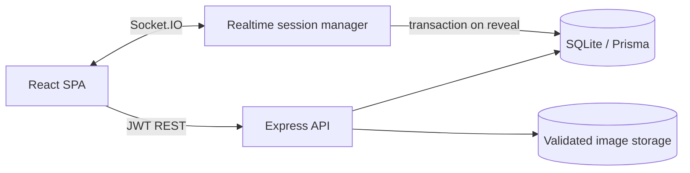

# VK Quiz

[](https://github.com/kirpepa/realtime-quiz-platform/actions/workflows/ci.yml)

Full-stack платформа для проведения квизов в реальном времени. Организатор
собирает квиз и управляет ходом игры, участники входят по короткому коду, а
сервер синхронно показывает вопросы, принимает ответы и строит лидерборд.

Это не статическая демонстрация интерфейса: основной сценарий проходит через
REST API, Socket.IO и транзакционное сохранение результатов в SQLite.

## Что реализовано

- роли организатора и участника, гостевой вход в игру;
- access/refresh JWT, автоматическое обновление access-токена и guards по роли и владельцу;
- редактор квизов: одиночный/множественный выбор, индивидуальный таймер,
  изображения, порядок вопросов и правила начисления баллов;
- серверный дедлайн как источник истины: клиентский таймер не определяет,
  успел ли игрок ответить;
- live-прогресс, reveal правильного ответа и лидерборд после каждого вопроса;
- восстановление игрока после обрыва по `rejoinToken` или authenticated user id;
- защита от захвата чужого `participantId` и от двух активных socket-соединений
  одной игровой личности;
- атомарная запись ответа и накопленного счёта перед публикацией reveal;
- история проведённых игр и участий.

## Архитектура



| Слой | Технологии |
|---|---|
| Frontend | React 18, React Router 7, Vite 7, Tailwind CSS |
| API | Node.js 22, Express 5, Prisma ORM |
| Realtime | Socket.IO, rooms, ack + timeout, reconnect/resync |
| Data | SQLite, Prisma migrations and transactions |
| Security | bcrypt, typed JWT, Helmet, CORS, REST/socket rate limits |
| Delivery | Docker multi-stage build, health checks, graceful shutdown, GitHub Actions |

Состояние активного вопроса хранится в памяти одного процесса; ответы и баллы
фиксируются в БД перед событием `question:reveal`. Поэтому текущая версия
рассчитана на один экземпляр приложения. Для горизонтального масштабирования
понадобятся PostgreSQL, общий state store и Socket.IO Redis adapter.

Подробности: [архитектура](docs/ARCHITECTURE.md), [модель данных](docs/DATABASE.md),
[диаграммы](docs/DIAGRAMS.md).

## Локальный запуск

Нужны Node.js 22.12+ и npm 10+.

```bash
npm run install:all
cp server/.env.example server/.env
npm run setup:server
```

Затем в двух терминалах:

```bash
npm run dev:server
npm run dev:client
```

Интерфейс: <http://localhost:5173>. API и Socket.IO: <http://localhost:4000>.

После seed доступен демонстрационный организатор:
`demo@quiz.dev` / `password123`.

JWT-секретов по умолчанию нет: вне `NODE_ENV=test` сервер завершит запуск, если
они отсутствуют или короче 32 байт. Для production создайте два разных секрета:

```bash
openssl rand -hex 32
openssl rand -hex 32
```

## Docker

```bash
docker compose up --build
```

Приложение будет доступно на <http://localhost:4000>. Compose-файл содержит
только локальные демонстрационные секреты; перед реальным развёртыванием их
нужно заменить. Данные и изображения сохраняются в named volumes.

Проверки оркестратора:

- liveness: `GET /api/health`;
- readiness с запросом к БД: `GET /api/health/ready`;
- `SIGTERM`/`SIGINT`: сервер перестаёт принимать соединения, закрывает игровые
  комнаты и отключается от Prisma в пределах заданного таймаута.

## Проверки

```bash
npm test --prefix server          # node:test: scoring, JWT, config, file signatures
npm run build --prefix client     # production frontend build
npm run audit                     # server + client dependency audit
```

Интеграционные сценарии запускаются против подготовленного работающего сервера:

```bash
npm run test:api --prefix client
npm run test:security --prefix client
npm run test:e2e --prefix client
```

GitHub Actions на каждый pull request устанавливает зависимости через
`npm ci`, запускает unit-тесты, production build, dependency audit, применяет
миграции и проверяет REST + realtime сценарий с несколькими Socket.IO-клиентами.

## Защитные меры

- JWT принимает только HS256, проверяет issuer, audience и тип токена;
- refresh-токен нельзя использовать как access-токен;
- лимиты тела запроса и частоты запросов; отдельный лимит upload/auth;
- изображения ограничены 5 МБ, проверяются и по MIME, и по magic bytes, получают
  случайное серверное имя и отдаются с `nosniff`;
- correct-answer flags не отправляются клиенту до reveal;
- неизвестные option ids, поздние ответы и ответы от заменённого socket отвергаются;
- ошибки БД не проглатываются: reveal/finish не меняют публичную фазу до успешной
  записи, ведущий получает восстанавливаемую ошибку и может повторить действие.

## Переменные окружения

| Переменная | Назначение |
|---|---|
| `DATABASE_URL` | URL SQLite, например `file:./dev.db` |
| `JWT_ACCESS_SECRET` | обязательный уникальный секрет, минимум 32 байта |
| `JWT_REFRESH_SECRET` | обязательный отдельный секрет, минимум 32 байта |
| `ACCESS_TOKEN_TTL` | TTL access-токена, по умолчанию `15m` |
| `REFRESH_TOKEN_TTL` | TTL refresh-токена, по умолчанию `7d` |
| `CLIENT_ORIGIN` | разрешённые origins через запятую |
| `TRUST_PROXY` | `true` только за доверенным reverse proxy |
| `MAX_PARTICIPANTS_PER_ROOM` | лимит игроков, по умолчанию `200` |
| `SHUTDOWN_TIMEOUT_MS` | предел graceful shutdown, по умолчанию `10000` |
| `VITE_API_URL` | адрес API для frontend; пустая строка означает same-origin |

## Осознанные ограничения

- SQLite и in-memory room state означают один replica/process;
- refresh-токены stateless: нет server-side отзыва отдельных сессий;
- изображения лежат на локальном volume, без object storage и антивирусного сканирования.

Эти ограничения сохранены явно, чтобы проект не обещал свойства, которых у
текущей реализации нет.
